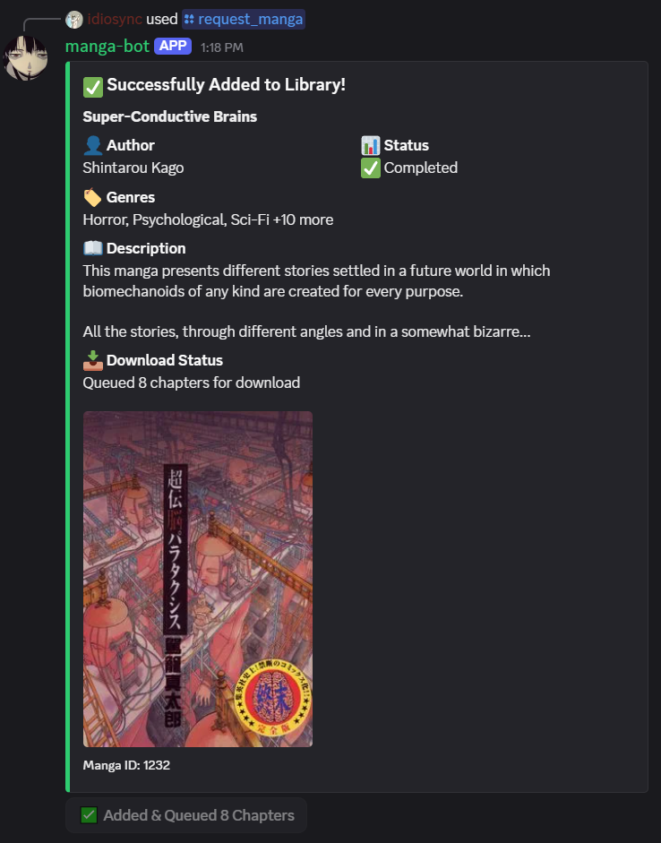

# Suwayomi Discord Bot

A Discord bot that integrates with [Suwayomi-Server](https://github.com/Suwayomi/Suwayomi-Server) to search, manage, and download manga directly through Discord.

## Features

### 📚 Library Management
- **Library Statistics** - View comprehensive stats about your manga library
- **Search Manga** - Search across all available sources with interactive selection
- **Add to Library** - Easily add manga to your library and queue downloads
- **Rich Presence** - Bot displays downloaded chapter count in its status

### ⬇️ Download Management  
- **Download Status** - Monitor active downloads with progress bars
- **Automatic Chapter Fetching** - Automatically fetch chapter lists when adding manga
- **Batch Downloads** - Queue all chapters for download in one click

### 🔍 Advanced Features
- **Multi-Source Search** - Search across up to 20 manga sources simultaneously
- **Interactive Dropdowns** - Easy manga selection with Discord's native UI
- **Cover Image Display** - View manga covers directly in Discord
- **Detailed Metadata** - Shows author, artist, genres, status, and chapter info
- **NSFW Filtering** - Optional NSFW source filtering

## Screenshots
<p align="left">
  
</p>

## Prerequisites

- **Python 3.8+**
- **Suwayomi-Server** (running and accessible)
- **Discord Bot Token** (from Discord Developer Portal)

# Installation

## Docker

1. `docker pull idiosync000/suwayomi-bot:latest`
2. Pass the environment variables (see below).

## Local
### 1. Clone the Repository

```bash
git clone https://github.com/idio-sync/suwayomi-discord-bot.git
cd suwayomi-discord-bot
```

### 2. Install Dependencies

```bash
pip install -r requirements.txt
```

Required packages:
- `py-cord` (Discord bot framework)
- `aiohttp` (Async HTTP client)
- `python-dotenv` (Environment variable management)

### 3. Configure Environment Variables

Create a `.env` file in the project root:

```env
# Discord Configuration
DISCORD_TOKEN=your_discord_bot_token_here
GUILD_ID=your_guild_id_for_testing  # Optional: for faster command sync

# Suwayomi Configuration
SUWAYOMI_URL=http://localhost:4567
SUWAYOMI_API_KEY=your_suwayomi_api_key

# Optional: Logging
LOG_LEVEL=INFO  # Options: DEBUG, INFO, WARNING, ERROR
```

#### Getting Your Discord Bot Token

1. Go to [Discord Developer Portal](https://discord.com/developers/applications)
2. Create a new application or select an existing one
3. Navigate to the **Bot** section
4. Click **Reset Token** and copy your token
5. Enable these **Privileged Gateway Intents**:
   - Message Content Intent
   - Server Members Intent

#### Getting Your Suwayomi API Key

1. Open Suwayomi-Server web interface
2. Navigate to **Settings** → **Server**
3. Find or generate your **API Key**
4. Copy the key to your `.env` file

### 4. Invite Bot to Server

Generate an invite link with these permissions:
- **Scopes**: `bot`, `applications.commands`
- **Bot Permissions**: 
  - Send Messages
  - Embed Links
  - Attach Files
  - Use Slash Commands

Invite URL format:
```
https://discord.com/api/oauth2/authorize?client_id=YOUR_BOT_CLIENT_ID&permissions=274877991936&scope=bot%20applications.commands
```

### 5. Run the Bot

```bash
python bot.py
```

You should see:
```
INFO - SuwayomiBot initialized
INFO - Connected to Suwayomi v2.x.x
INFO - BotName#1234 has connected to Discord!
```

## Commands

### `/library_stats`
View statistics about your Suwayomi library.

**Displays:**
- Total manga in library
- Total chapters
- Unread chapters
- Downloaded chapters
- Categories and sources

---

### `/request_manga`
Search for manga across all available sources.

**Parameters:**
- `query` (required) - Search term (e.g., "One Piece")
- `limit` (optional) - Results per source (1-10, default: 5)
- `include_nsfw` (optional) - Include NSFW sources (default: false)

**Features:**
- Searches up to 20 sources simultaneously
- Interactive dropdown selection
- Detailed manga information with cover images
- One-click add to library and download

---

### `/downloads`
Show current download queue status.

**Displays:**
- Downloader state (Running/Stopped)
- Active downloads with progress bars
- Manga and chapter names
- Download percentage

## Configuration

### Log Levels

Set `LOG_LEVEL` in your `.env` file:

- `DEBUG` - Verbose logging for development
- `INFO` - Standard operational logging (recommended)
- `WARNING` - Only warnings and errors
- `ERROR` - Only error messages

### Guild ID (Optional)

Setting `GUILD_ID` makes commands sync instantly to your specific server. Without it, commands sync globally (takes up to 1 hour).

## Troubleshooting

### Bot doesn't connect to Suwayomi

**Check:**
1. Suwayomi-Server is running (`http://localhost:4567` should be accessible)
2. API key is correct in `.env`
3. URL doesn't have trailing slash or quotes
4. Firewall allows connection

**Test connection:**
```bash
curl -H "Authorization: Bearer YOUR_API_KEY" http://localhost:4567/api/graphql
```

### Commands don't appear in Discord

**Solutions:**
1. Ensure bot has `applications.commands` scope
2. Wait up to 1 hour for global command sync, or set `GUILD_ID` for instant testing
3. Check bot permissions in your server
4. Restart Discord client

### Search returns no results

**Check:**
1. Extensions are installed in Suwayomi
2. Sources are not down
3. Try broader search terms
4. Enable NSFW if searching for mature content

### Images not showing

**Possible causes:**
1. Discord embed permissions
2. Suwayomi server not accessible from internet (if bot is hosted remotely)
3. Source image URLs expired

## Rich Presence

The bot automatically updates its status every hour to show:

```
Playing librarian with X,XXX chapters
```

Where X,XXX is the total number of downloaded chapters in your library.

## Rate Limiting & Performance

- Search queries are throttled (0.3s delay between sources)
- Download batches process 50 chapters at a time
- Session keepalive with connection pooling
- Automatic retry logic for failed requests

## Contributing

Contributions are welcome! Please feel free to submit a Pull Request.

### Development Setup

1. Set `LOG_LEVEL=DEBUG` for verbose logging
2. Use `GUILD_ID` for instant command testing
3. Test against a non-production Suwayomi instance

## Support

- **Suwayomi Issues**: [Suwayomi-Server GitHub](https://github.com/Suwayomi/Suwayomi-Server/issues)
- **Bot Issues**: [Open an issue on this repository]

## Acknowledgments

- [Suwayomi-Server](https://github.com/Suwayomi/Suwayomi-Server) - The manga server this bot integrates with
- [Pycord](https://github.com/Pycord-Development/pycord) - Discord bot framework

---

**Note**: This bot is not affiliated with or endorsed by Suwayomi. It's a third-party integration tool.
